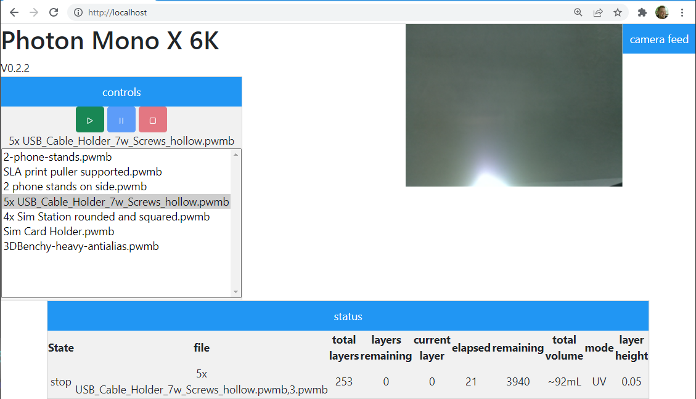

# Mono X Printers

This is an alternative web-ui for Anycubic Mono X printers.

You can get stats, select, start, stop, pause, and monitor your Mono X printer.

note to change the printer ID, currently you must modify the js/script.js file.  
This will be updated to use an environmental variable in the near future.
